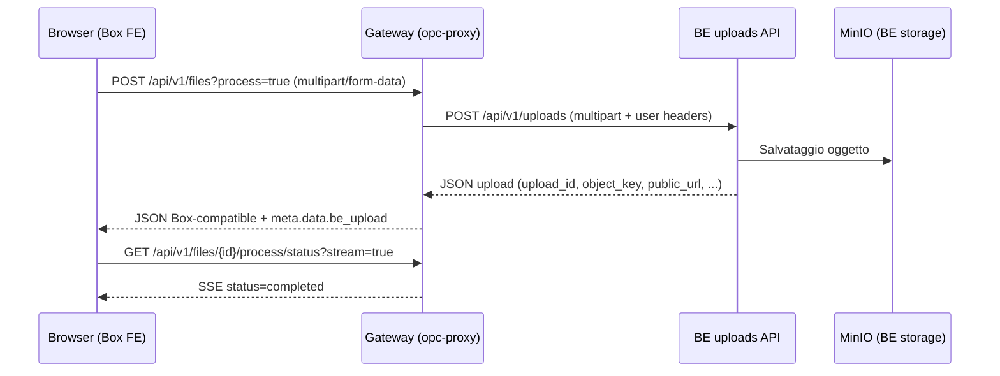
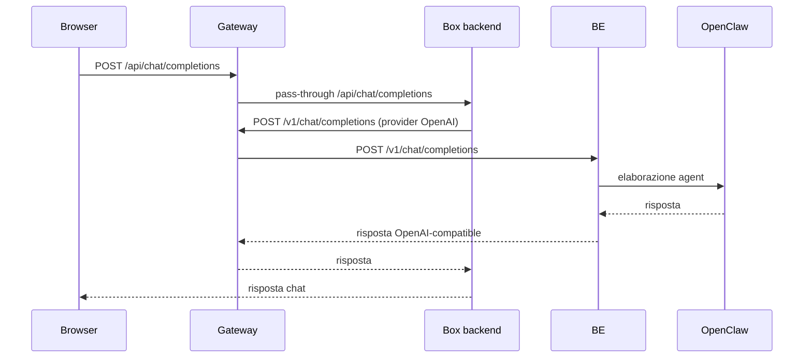

# Flusso Dati Edge Gateway (container, porte, route)

Data aggiornamento: 2026-03-13

## Topologia runtime (locale test)

| Nodo | Container/Servizio | Porta | Ruolo |
| --- | --- | --- | --- |
| Browser | n/a | `localhost:3001` | entrypoint unico FE/API |
| Gateway | `opc-proxy` | `3001 -> 4010`, `4010 -> 4010` | edge routing + intercetto upload + provider OpenAI-compatible |
| BoxedAI | `open-webui` | `3002 -> 8080` | backend Open WebUI (route API non intercettate) |
| Vector DB | `mvp-qdrant` | `6333 -> 6333` | storage embedding/retrieval Box |
| BE | `be-boxedai` remoto | `443` | API backend upload/completions |
| OPC runtime | esterno | `18789` / `18789/ws` | runtime agent (a valle del BE) |

## Schema generale (grafico)

```mermaid
flowchart LR
    U[Browser\nlocalhost:3001] --> G[opc-proxy\n:4010]

    G -->|pass-through default| B[open-webui\n:8080 (host:3002)]
    G -->|upload/completions| BE[be-boxedai-contabo\nhttps :443]
    BE --> OPC[OpenClaw runtime\n:18789 /ws]
    B --> Q[mvp-qdrant\n:6333]
```

## Flusso upload file (implementato)



## Flusso chat/completions (corrente)



## Evidenza runtime upload (log gateway)

Dal test E2E:

- `POST /api/v1/files/?process=true` `200 OK`
- `GET /api/v1/files/{id}/process/status?stream=true` `200 OK`
- payload BE acquisito con campi: `upload_id`, `object_key`, `download_url`, `public_url`
- payload Box ritornato con:
  - `id = upload_id`
  - `meta.data.be_upload.*` (metadati BE riutilizzabili in fase completion)

## Prossimo step tecnico (già pianificato)

Prima di inoltrare completions:

1. leggere i metadati file (`meta.data.be_upload` o chiavi correlate)
2. se necessario eseguire lookup `GET /api/v1/uploads`
3. estrarre `public_url`
4. iniettare/sostituire riferimento file nel payload completion
5. inoltrare verso `POST /v1/chat/completions`
