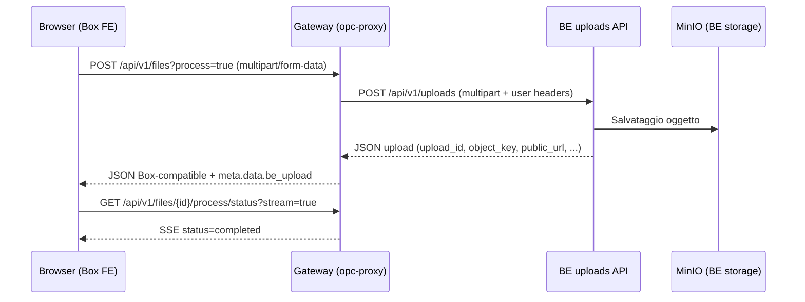
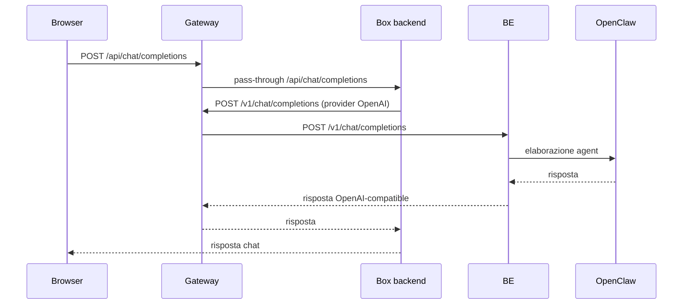
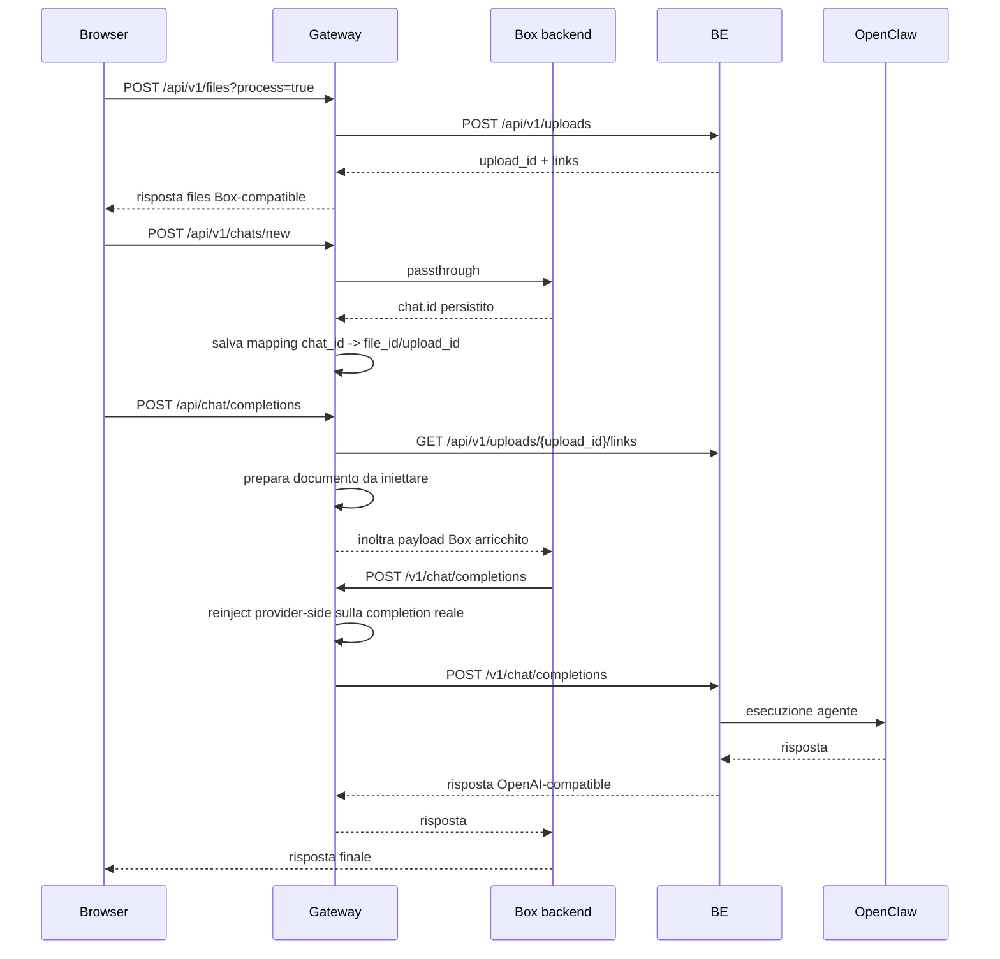

# Flusso Dati Edge Gateway (container, porte, route)

Data aggiornamento: 2026-03-13

## Executive summary

Il gateway `opc-proxy` e oggi il punto di ingresso corretto per BoxedAI.

In VPS, se il dominio pubblico Box e servito da `Caddy`, l'upstream corretto del vhost deve essere:

- `opc-proxy:4010`

e non:

- `open-webui:8080`

Obiettivo raggiunto nel perimetro gateway:

- upload file intercettato su `POST /api/v1/files`
- inoltro reale a `be /api/v1/uploads`
- risposta adattata in shape Box-compatible
- correlazione chat/file mantenuta dal gateway
- reinject del riferimento documento sulla completion reale emessa da Box verso il provider `/v1/chat/completions`

Punto aperto residuo:

- il `be` restituisce ancora link documento che non sono immediatamente utilizzabili fuori dal suo network locale (`localhost:9000`) oppure espone `download_url` che va verificato lato deployment
- questo punto e nel perimetro `be`/storage exposure, non nel perimetro gateway

## Topologia runtime (locale test)

| Nodo | Container/Servizio | Porta | Ruolo |
| --- | --- | --- | --- |
| Browser | n/a | `localhost:3001` | entrypoint unico FE/API |
| Gateway | `opc-proxy` | `3001 -> 4010`, `4010 -> 4010` | edge routing + intercetto upload + provider OpenAI-compatible |
| BoxedAI | `open-webui` | `3002 -> 8080` | backend Open WebUI (route API non intercettate) |
| LLM locale Box | `ollama` | `11434` interno Docker | servizio locale Box, non pubblicato nel compose test |
| Vector DB | `mvp-qdrant` | `6333 -> 6333` | storage embedding/retrieval Box |
| BE | `be-boxedai` remoto | `443` | API backend upload/completions |
| BE app (dev) | processo FastAPI | `8000` | porta applicativa BFF quando avviato con `scripts/dev_run.sh` |
| BE DB | `openclaw_bff_postgres` | `5432 -> 5432` | Postgres |
| BE storage | `openclaw_bff_minio` | `9000 -> 9000`, `9001 -> 9001` | object storage + console |
| BE auth | `openclaw_bff_keycloak` | `8080 -> 8080` | autenticazione OIDC |
| OPC runtime | esterno | `18789` / `18789/ws` | runtime agent (a valle del BE) |

## Schema generale (grafico)

```mermaid
flowchart LR
    BR[Browser\nlocalhost:3001] --> G[opc-proxy\n:4010]

    G -->|pass-through default| B[open-webui\n:8080 (host:3002)]
    G -->|upload/completions| BE[be-boxedai-contabo\nhttps :443]
    B --> O[ollama\n:11434 interno]
    BE --> OPC[OpenClaw runtime\n:18789 /ws]
    B --> Q[mvp-qdrant\n:6333]
    BE --> PG[postgres\n:5432]
    BE --> M[minio\n:9000 / :9001]
    BE --> KC[keycloak\n:8080]
```

## Flusso upload file (implementato)



## Flusso chat/completions (corrente)



## Flusso completo documento + chat (implementato nel gateway)



## Evidenza runtime upload e inject (log gateway)

Dal test E2E:

- `POST /api/v1/files/?process=true` `200 OK`
- `GET /api/v1/files/{id}/process/status?stream=true` `200 OK`
- `POST /api/v1/chats/new` intercettata e correlata con `chat_id`
- `POST /api/chat/completions` intercettata con payload browser-side
- `/v1/chat/completions` finale reintegrata con contesto documento dal gateway
- payload BE acquisito con campi: `upload_id`, `object_key`, `download_url`, `public_url`
- payload Box ritornato con:
  - `id = upload_id`
  - `meta.data.be_upload.*` (metadati BE riutilizzabili in fase completion)
- logs chiave disponibili:
  - `EDGE upload -> BE ...`
  - `EDGE chats.new sync ...`
  - `EDGE browser chat.forward ...`
  - `EDGE provider.pending ...`
  - `proxy→be pending.documents ...`

## Formato inject documento (corrente)

Il gateway aggiunge il riferimento documento all'ultimo messaggio `user` in forma testuale:

```text
Attached documents:
- powerskid.pdf: https://...
```

Questo inject avviene:

1. browser-side su `POST /api/chat/completions`
2. provider-side sulla vera `POST /v1/chat/completions` emessa da Box, se Box ricostruisce il payload e perde l'inject precedente

## Limitazione residua

Il gateway ha chiuso il problema di intercetto, correlazione e reinject.

Resta aperto lato `be`/storage:

- `GET /api/v1/uploads/{upload_id}/links` restituisce ancora:
  - `public_url` con host locale MinIO (`localhost:9000`)
  - `presigned_get_url` anch'esso su host locale
- il gateway ripiega su `download_url` assolutizzato sul dominio BE pubblico
- la raggiungibilita finale del contenuto documento da parte di OPC dipende quindi da una correzione lato `be` o dall'esposizione corretta dello storage/document download
